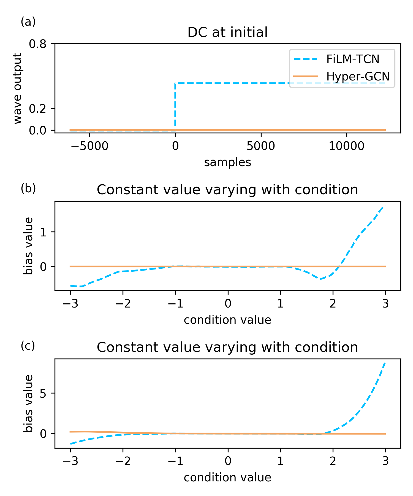

This is the demo page for the paper **"Designing Bias-free Models for Neural Audio Effect Modeling"**.

## Abstract
Micro-temporal convolutional network (micro-TCN) has gained popularity as a promising architecture for modeling neural audio effects. The network utilizes dilated 1D convolutions to process music in the waveform domain and incorporates conditioning modules that adjust the gain and bias of each layer based on control parameters that emulate a specific audio effect. Despite the effectiveness of micro-TCN, our research has uncovered an issue related to the biases arose from its convolution layers and conditioning modules. Such biases lead to audible artefacts at the output when the input signal is silent,  and may unfavorably decrease the headroom of dynamic range in general. To account for this issue, we propose a ``bias-free'' alternative of micro-TCN that avoids adapting the bias in each intermediate layer. This involves using gated convolutions as the model backbone, hyper networks as the conditioning module, and removing batch normalization entirely. Our experiments on emulating time-invariant guitar effects created by either software or real devices demonstrate that the proposed design eliminates unwanted DC bias without losing the capacity of micro-TCN in audio effect modeling.

## Motivation 

 
Observation in three secanrios. 
 
(a) Given a silent input, the output of the FiLM-TCN has unexpectedly a DC shift, while the proposed bias-free model Hyper-GCN does not.
 
 
(b) The incurred DC shift varies as a function of the imposed condition parameter for FiLM-TCN, while there is no DC bias at all for Hyper-GCN.
 
 
(c) After receiving a non-silent input, we compute the mean amplitude of the output produced by the FiLM-TCN. We observe that the trend of DC bias variation is very similar to (b).
 

 
 
The above situation shows the following problems:
1. If a silent input is fed into the model and produces a non-silent output, it may result in an unexpected popping sound or noise.
2. When the bias value fluctuates with the conditions, it can reduce the headroom of the dynamic range or cause sound clipping.

#### Case 1

#### Case 2

FiLM-TCN: 
<audio controls=""><source src="./assets/case_1/film_tcn.wav" type="audio/mpeg" /></audio>
Hyper-GCN: <audio controls=""><source src="./assets/case_1/hyper_gcn.wav" type="audio/mpeg" /></audio>

## Audio Samples

We have provided two sets of audio files for each simulated effect in our experiments. Each sets contains DI, real, and results simulated by different models. The duration of each listening file is about 5 seconds. The detailed information is shown below. 

1. `DI`: clean audio which is considered to be the input to our model. 
2. `RD`: effected audio which is considered to be the target we aim to simulate.
3. `FT`: effected audio created from the model `FiLM-TCN` 
4. `FG`: effected audio created from the model `FiLM-GCN` 
5. `HG` (proposed): effected audio created from the model `Hyper-GCN` 
6. `HG-WS` (proposed): effected audio created from the model `Hyper-GCN-WS` (Hyper-GCN with weight sharing strategy)

#### EGDB + Distortion
<table style='text-align: center;'>
  <tbody>
    <tr>
      <td></td>
      <td>db</td>
      <td>DI</td>
      <td>RD</td>
      <td>FT</td>
      <td>FG</td>
      <td>HG</td>
      <td>HG-WS</td>
    </tr>
    <tr>
      <td rowspan="0">A</td>
      <td>20</td>
      <td rowspan="0"><audio controls="" style="width: 100px;"><source src="./assets/audios/Distortion/A/di.wav" type="audio/mpeg" /></audio></td>
      <td><audio controls="" style="width: 100px;"><source src="./assets/audios/Distortion/A/20/rd.wav" type="audio/mpeg" /></audio></td>
      <td><audio controls="" style="width: 100px;"><source src="./assets/audios/Distortion/A/20/ft.wav" type="audio/mpeg" /></audio></td>
      <td><audio controls="" style="width: 100px;"><source src="./assets/audios/Distortion/A/20/fg.wav" type="audio/mpeg" /></audio></td>
      <td><audio controls="" style="width: 100px;"><source src="./assets/audios/Distortion/A/20/hg.wav" type="audio/mpeg" /></audio></td>
      <td><audio controls="" style="width: 100px;"><source src="./assets/audios/Distortion/A/20/hg_ws.wav" type="audio/mpeg" /></audio></td>
    </tr>
    <tr>
      <td>25</td>
      <td><audio controls="" style="width: 100px;"><source src="./assets/audios/Distortion/A/25/rd.wav" type="audio/mpeg" /></audio></td>
      <td><audio controls="" style="width: 100px;"><source src="./assets/audios/Distortion/A/25/ft.wav" type="audio/mpeg" /></audio></td>
      <td><audio controls="" style="width: 100px;"><source src="./assets/audios/Distortion/A/25/fg.wav" type="audio/mpeg" /></audio></td>
      <td><audio controls="" style="width: 100px;"><source src="./assets/audios/Distortion/A/25/hg.wav" type="audio/mpeg" /></audio></td>
      <td><audio controls="" style="width: 100px;"><source src="./assets/audios/Distortion/A/25/hg_ws.wav" type="audio/mpeg" /></audio></td>
    </tr>
  </tbody>
</table>

<table style='text-align: center;'>
  <tbody>
    <tr>
      <td></td>
      <td>db</td>
      <td>DI</td>
      <td>RD</td>
      <td>FT</td>
      <td>FG</td>
      <td>HG</td>
      <td>HG-WS</td>
    </tr>
    <tr>
      <td rowspan="0">B</td>
      <td>20</td>
      <td rowspan="0"><audio controls="" style="width: 100px;"><source src="./assets/audios/Distortion/B/di.wav" type="audio/mpeg" /></audio></td>
      <td><audio controls="" style="width: 100px;"><source src="./assets/audios/Distortion/B/20/rd.wav" type="audio/mpeg" /></audio></td>
      <td><audio controls="" style="width: 100px;"><source src="./assets/audios/Distortion/B/20/ft.wav" type="audio/mpeg" /></audio></td>
      <td><audio controls="" style="width: 100px;"><source src="./assets/audios/Distortion/B/20/fg.wav" type="audio/mpeg" /></audio></td>
      <td><audio controls="" style="width: 100px;"><source src="./assets/audios/Distortion/B/20/hg.wav" type="audio/mpeg" /></audio></td>
      <td><audio controls="" style="width: 100px;"><source src="./assets/audios/Distortion/B/20/hg_ws.wav" type="audio/mpeg" /></audio></td>
    </tr>
    <tr>
      <td>25</td>
      <td><audio controls="" style="width: 100px;"><source src="./assets/audios/Distortion/B/25/rd.wav" type="audio/mpeg" /></audio></td>
      <td><audio controls="" style="width: 100px;"><source src="./assets/audios/Distortion/B/25/ft.wav" type="audio/mpeg" /></audio></td>
      <td><audio controls="" style="width: 100px;"><source src="./assets/audios/Distortion/B/25/fg.wav" type="audio/mpeg" /></audio></td>
      <td><audio controls="" style="width: 100px;"><source src="./assets/audios/Distortion/B/25/hg.wav" type="audio/mpeg" /></audio></td>
      <td><audio controls="" style="width: 100px;"><source src="./assets/audios/Distortion/B/25/hg_ws.wav" type="audio/mpeg" /></audio></td>
    </tr>
  </tbody>
</table>

#### EGDB + Tone Stack
<table style='text-align: center;'>
  <tbody>
    <tr>
      <td></td>
      <td>db</td>
      <td>DI</td>
      <td>RD</td>
      <td>FT</td>
      <td>FG</td>
      <td>HG</td>
      <td>HG-WS</td>
    </tr>
    <tr>
      <td rowspan="0">A</td>
      <td>Bass: -2, Mids: -3, Treble: 5</td>
      <td rowspan="0"><audio controls="" style="width: 100px;"><source src="./assets/audios/ToneStack/A/di.wav" type="audio/mpeg" /></audio></td>
      <td><audio controls="" style="width: 100px;"><source src="./assets/audios/ToneStack/A/-2_-3_5/rd.wav" type="audio/mpeg" /></audio></td>
      <td><audio controls="" style="width: 100px;"><source src="./assets/audios/ToneStack/A/-2_-3_5/ft.wav" type="audio/mpeg" /></audio></td>
      <td><audio controls="" style="width: 100px;"><source src="./assets/audios/ToneStack/A/-2_-3_5/fg.wav" type="audio/mpeg" /></audio></td>
      <td><audio controls="" style="width: 100px;"><source src="./assets/audios/ToneStack/A/-2_-3_5/hg.wav" type="audio/mpeg" /></audio></td>
      <td><audio controls="" style="width: 100px;"><source src="./assets/audios/ToneStack/A/-2_-3_5/hg_ws.wav" type="audio/mpeg" /></audio></td>
    </tr>
    <tr>
      <td>Bass: -3, Mids: 6, Treble: 5</td>
      <td><audio controls="" style="width: 100px;"><source src="./assets/audios/ToneStack/A/-3_6_5/rd.wav" type="audio/mpeg" /></audio></td>
      <td><audio controls="" style="width: 100px;"><source src="./assets/audios/ToneStack/A/-3_6_5/ft.wav" type="audio/mpeg" /></audio></td>
      <td><audio controls="" style="width: 100px;"><source src="./assets/audios/ToneStack/A/-3_6_5/fg.wav" type="audio/mpeg" /></audio></td>
      <td><audio controls="" style="width: 100px;"><source src="./assets/audios/ToneStack/A/-3_6_5/hg.wav" type="audio/mpeg" /></audio></td>
      <td><audio controls="" style="width: 100px;"><source src="./assets/audios/ToneStack/A/-3_6_5/hg_ws.wav" type="audio/mpeg" /></audio></td>
    </tr>
  </tbody>
</table>

<table style='text-align: center;'>
  <tbody>
    <tr>
      <td></td>
      <td>db</td>
      <td>DI</td>
      <td>RD</td>
      <td>FT</td>
      <td>FG</td>
      <td>HG</td>
      <td>HG-WS</td>
    </tr>
    <tr>
      <td rowspan="0">B</td>
      <td>Bass: 3, Mids: 8, Treble: -8</td>
      <td rowspan="0"><audio controls="" style="width: 100px;"><source src="./assets/audios/ToneStack/B/di.wav" type="audio/mpeg" /></audio></td>
      <td><audio controls="" style="width: 100px;"><source src="./assets/audios/ToneStack/B/3_8_-8/rd.wav" type="audio/mpeg" /></audio></td>
      <td><audio controls="" style="width: 100px;"><source src="./assets/audios/ToneStack/B/3_8_-8/ft.wav" type="audio/mpeg" /></audio></td>
      <td><audio controls="" style="width: 100px;"><source src="./assets/audios/ToneStack/B/3_8_-8/fg.wav" type="audio/mpeg" /></audio></td>
      <td><audio controls="" style="width: 100px;"><source src="./assets/audios/ToneStack/B/3_8_-8/hg.wav" type="audio/mpeg" /></audio></td>
      <td><audio controls="" style="width: 100px;"><source src="./assets/audios/ToneStack/B/3_8_-8/hg_ws.wav" type="audio/mpeg" /></audio></td>
    </tr>
    <tr>
      <td>Bass: 6, Mids: -9, Treble: 3</td>
      <td><audio controls="" style="width: 100px;"><source src="./assets/audios/ToneStack/B/6_-9_3/rd.wav" type="audio/mpeg" /></audio></td>
      <td><audio controls="" style="width: 100px;"><source src="./assets/audios/ToneStack/B/6_-9_3/ft.wav" type="audio/mpeg" /></audio></td>
      <td><audio controls="" style="width: 100px;"><source src="./assets/audios/ToneStack/B/6_-9_3/fg.wav" type="audio/mpeg" /></audio></td>
      <td><audio controls="" style="width: 100px;"><source src="./assets/audios/ToneStack/B/6_-9_3/hg.wav" type="audio/mpeg" /></audio></td>
      <td><audio controls="" style="width: 100px;"><source src="./assets/audios/ToneStack/B/6_-9_3/hg_ws.wav" type="audio/mpeg" /></audio></td>
    </tr>
  </tbody>
</table>

#### EGFX

<table style='text-align: center;'>
  <tbody>
    <tr>
      <td></td>
      <td>Effect Type</td>
      <td>DI</td>
      <td>RD</td>
      <td>FT</td>
      <td>FG</td>
      <td>HG</td>
      <td>HG-WS</td>
    </tr>
    <tr>
      <td rowspan="0">A</td>
      <td>RAT</td>
      <td rowspan="0"><audio controls="" style="width: 100px;"><source src="./assets/audios/EGFx/A/di.wav" type="audio/mpeg" /></audio></td>
      <td><audio controls="" style="width: 100px;"><source src="./assets/audios/EGFx/A/RAT/rd.wav" type="audio/mpeg" /></audio></td>
      <td><audio controls="" style="width: 100px;"><source src="./assets/audios/EGFx/A/RAT/ft.wav" type="audio/mpeg" /></audio></td>
      <td><audio controls="" style="width: 100px;"><source src="./assets/audios/EGFx/A/RAT/fg.wav" type="audio/mpeg" /></audio></td>
      <td><audio controls="" style="width: 100px;"><source src="./assets/audios/EGFx/A/RAT/hg.wav" type="audio/mpeg" /></audio></td>
      <td><audio controls="" style="width: 100px;"><source src="./assets/audios/EGFx/A/RAT/hg_ws.wav" type="audio/mpeg" /></audio></td>
    </tr>
    <tr>
      <td>BluesDriver</td>
      <td><audio controls="" style="width: 100px;"><source src="./assets/audios/EGFx/A/BluesDriver/rd.wav" type="audio/mpeg" /></audio></td>
      <td><audio controls="" style="width: 100px;"><source src="./assets/audios/EGFx/A/BluesDriver/ft.wav" type="audio/mpeg" /></audio></td>
      <td><audio controls="" style="width: 100px;"><source src="./assets/audios/EGFx/A/BluesDriver/fg.wav" type="audio/mpeg" /></audio></td>
      <td><audio controls="" style="width: 100px;"><source src="./assets/audios/EGFx/A/BluesDriver/hg.wav" type="audio/mpeg" /></audio></td>
      <td><audio controls="" style="width: 100px;"><source src="./assets/audios/EGFx/A/BluesDriver/hg_ws.wav" type="audio/mpeg" /></audio></td>
    </tr>
    <tr>
      <td>TubeScreamer</td>
      <td><audio controls="" style="width: 100px;"><source src="./assets/audios/EGFx/A/TubeScreamer/rd.wav" type="audio/mpeg" /></audio></td>
      <td><audio controls="" style="width: 100px;"><source src="./assets/audios/EGFx/A/TubeScreamer/ft.wav" type="audio/mpeg" /></audio></td>
      <td><audio controls="" style="width: 100px;"><source src="./assets/audios/EGFx/A/TubeScreamer/fg.wav" type="audio/mpeg" /></audio></td>
      <td><audio controls="" style="width: 100px;"><source src="./assets/audios/EGFx/A/TubeScreamer/hg.wav" type="audio/mpeg" /></audio></td>
      <td><audio controls="" style="width: 100px;"><source src="./assets/audios/EGFx/A/TubeScreamer/hg_ws.wav" type="audio/mpeg" /></audio></td>
    </tr>
  </tbody>
</table>

<table style='text-align: center;'>
  <tbody>
    <tr>
      <td></td>
      <td>Effect Type</td>
      <td>DI</td>
      <td>RD</td>
      <td>FT</td>
      <td>FG</td>
      <td>HG</td>
      <td>HG-WS</td>
    </tr>
    <tr>
      <td rowspan="0">B</td>
      <td>RAT</td>
      <td rowspan="0"><audio controls="" style="width: 100px;"><source src="./assets/audios/EGFx/B/di.wav" type="audio/mpeg" /></audio></td>
      <td><audio controls="" style="width: 100px;"><source src="./assets/audios/EGFx/B/RAT/rd.wav" type="audio/mpeg" /></audio></td>
      <td><audio controls="" style="width: 100px;"><source src="./assets/audios/EGFx/B/RAT/ft.wav" type="audio/mpeg" /></audio></td>
      <td><audio controls="" style="width: 100px;"><source src="./assets/audios/EGFx/B/RAT/fg.wav" type="audio/mpeg" /></audio></td>
      <td><audio controls="" style="width: 100px;"><source src="./assets/audios/EGFx/B/RAT/hg.wav" type="audio/mpeg" /></audio></td>
      <td><audio controls="" style="width: 100px;"><source src="./assets/audios/EGFx/B/RAT/hg_ws.wav" type="audio/mpeg" /></audio></td>
    </tr>
    <tr>
      <td>BluesDriver</td>
      <td><audio controls="" style="width: 100px;"><source src="./assets/audios/EGFx/B/BluesDriver/rd.wav" type="audio/mpeg" /></audio></td>
      <td><audio controls="" style="width: 100px;"><source src="./assets/audios/EGFx/B/BluesDriver/ft.wav" type="audio/mpeg" /></audio></td>
      <td><audio controls="" style="width: 100px;"><source src="./assets/audios/EGFx/B/BluesDriver/fg.wav" type="audio/mpeg" /></audio></td>
      <td><audio controls="" style="width: 100px;"><source src="./assets/audios/EGFx/B/BluesDriver/hg.wav" type="audio/mpeg" /></audio></td>
      <td><audio controls="" style="width: 100px;"><source src="./assets/audios/EGFx/B/BluesDriver/hg_ws.wav" type="audio/mpeg" /></audio></td>
    </tr>
    <tr>
      <td>TubeScreamer</td>
      <td><audio controls="" style="width: 100px;"><source src="./assets/audios/EGFx/B/TubeScreamer/rd.wav" type="audio/mpeg" /></audio></td>
      <td><audio controls="" style="width: 100px;"><source src="./assets/audios/EGFx/B/TubeScreamer/ft.wav" type="audio/mpeg" /></audio></td>
      <td><audio controls="" style="width: 100px;"><source src="./assets/audios/EGFx/B/TubeScreamer/fg.wav" type="audio/mpeg" /></audio></td>
      <td><audio controls="" style="width: 100px;"><source src="./assets/audios/EGFx/B/TubeScreamer/hg.wav" type="audio/mpeg" /></audio></td>
      <td><audio controls="" style="width: 100px;"><source src="./assets/audios/EGFx/B/TubeScreamer/hg_ws.wav" type="audio/mpeg" /></audio></td>
    </tr>
  </tbody>
</table>

### Contact 

